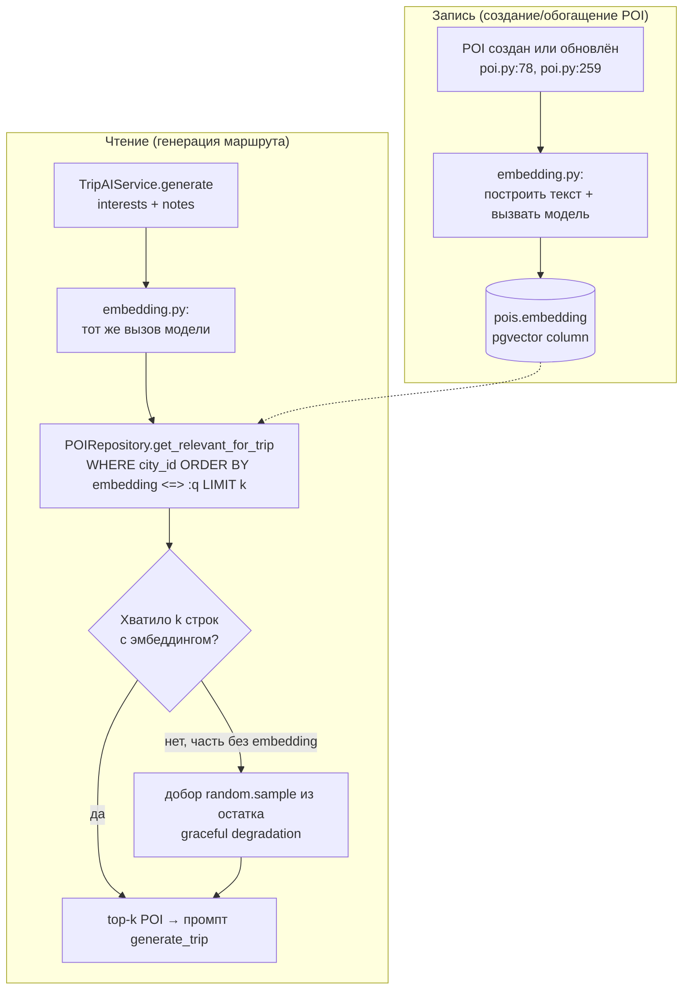

# RAG для подбора POI — план реализации

> Точка входа для реализации семантического отбора POI в `TripAIService.generate()`.
> Написано 2026-08-18 после анализа реальной БД (не гипотез). Все цифры ниже — из
> живой `travel_companion`, не из документации и не из головы. Перед стартом любой
> итерации перечитай раздел «Установленные факты» — он меняет решения по ходу плана.

## Зачем этот документ существует

Раньше договорились: заменить `random.sample()` в `TripAIService.generate()`
([backend/app/services/trip_ai.py:138-140](backend/app/services/trip_ai.py#L138))
на семантический top-k отбор POI по `interests`/`notes` пользователя. Это не
снижает токен-бюджет промпта (потолок `MAX_POIS_FOR_AI` уже есть и не меняется) —
это меняет, **какие** места в этот потолок попадают: сейчас — случайные, будет —
релевантные интересам.

## Установленные факты (проверено в БД 2026-08-18, не полагаться на память)

Эти факты меняют весь план — без них итерации ниже выглядели бы иначе и хуже.

1. **`random.sample()` уже режет данные прямо сейчас, не в будущем.**
   В базе засеяно 2 города с POI: Манама — 174 мест, Бодрум — 172. Оба уже
   превышают `MAX_POIS_FOR_AI=100` в production-режиме. То есть каждый вызов
   `/trips/{id}/generate` для этих городов **уже сегодня** случайно выбрасывает
   ~40% каталога до того, как AI вообще его увидит. Это не гипотетическая
   проблема роста — она активна на текущих данных.

2. **В POI нет никакого свободного описательного текста.** Смотрел прямо в БД:
   `description` = склеенные Google Place types, капитализированные
   (`app/core/maps.py:54`) — например `"Establishment, mosque"`,
   `"Bar, establishment"`. `information` = рейтинг + число отзывов + адрес
   (`app/core/maps.py:61`) — `"Рейтинг Google: 4.8 (5970 отзывов). Адрес: ..."`.
   Ни там, ни там нет ни слова о том, что это за место, для кого, какая
   атмосфера. Embedding, построенный на этих полях, будет кодировать
   **категорию места**, не смысл или атмосферу. Это не баг — это данность,
   с которой план должен считаться, а не которую план должен игнорировать.

3. **Реальная таксономия интересов — 6 фиксированных тегов**, взято из
   `frontend/src/pages/OnboardingStyle.jsx:17-22`, не выдумано:
   `relaxed`, `active`, `cultural`, `food`, `nature`, `night` + свободный текст
   `notes` (пожелания на день). Это то, что реально прилетает в `interests`.

4. **Из этих 6 тегов два — `relaxed` и `active` — не соответствуют вообще
   никакой категории Google Place.** Это темп/вайб, а не тип места. Кофейня
   может быть "relaxed", а может быть "active" (если это точка на маршруте
   шоппинг-марафона) — категория `cafe` тут ничего не решает. Прямое следствие:
   **сколько угодно точный category-matching (хоть SQL `WHERE`, хоть embedding
   по текущим полям) не решит эти два тега** — сигнала для них в данных просто
   нет физически. Это зафиксировано как известный, осознанный пробел, а не
   тихо игнорируется.

5. **Замер baseline на реальных данных.** Экспортировал 174 POI Манамы,
   собрал эталонную разметку по 4 категориальным тегам (`cultural`, `food`,
   `nature`, `night` — те два, что реально мапятся на категории) и прогнал
   `retrieval_evaluator.py` (skill `rag-architect`) через лексический
   TF-IDF baseline (без эмбеддингов):

   | Метрика | Значение |
   |---|---|
   | Precision@5 | 0.75 |
   | Recall@5 | 0.07 |
   | MRR | 0.75 |

   Recall@5 низкий структурно (в категории `night` 43 релевантных места из
   174 — top-5 физически не может покрыть больше 5/43). Это ожидаемо и не
   страшно: в проде мы не берём top-5, мы берём top-`MAX_POIS_FOR_AI` (40–100).
   Важный вывод из этого замера в другом: **прямое сравнение слов (лексика)
   работает нестабильно на смеси русского запроса и английских категорийных
   тегов** — при запросах на чистой смеси языков без нормализации тегов
   precision падает до нуля (первый прогон, до подстановки словаря тегов).
   Это подтверждает: нужна модель эмбеддингов с honest multilingual
   поддержкой, а не «любая», и уж точно не голый keyword-matching как
   дешёвая альтернатива RAG.

6. Данные лежат в `frontend/src/pages/NearbyPage.jsx:23-29` — там отдельный,
   не связанный с онбордингом, набор Google Place types для другого фильтра
   (`restaurant`, `museum`, `park`, `cafe`, `shopping_mall`, `night_club`).
   Подтверждает: категория Google Place — рабочая гранулярность для 4 из 6
   тегов интересов, что снижает риск того, что embedding по категорийным
   тегам окажется бесполезным для `cultural`/`food`/`nature`/`night`.

## Архитектурное решение и почему не «как по умолчанию»

Прогнал `rag_pipeline_designer.py` (skill `rag-architect`) на реальных цифрах
корпуса (346 документов, короткие структурные записи ~150 символов). Инструмент
по умолчанию предложил **Chroma** (отдельная векторная БД) и
**`sentence-transformers/all-MiniLM-L6-v2`** (английская модель). Оба выбора
здесь неверны для этого проекта, и вот почему — осознанное отклонение от
generic-рекомендации, не просмотр мимо неё:

- **Векторная БД: `pgvector` в существующем Postgres, не Chroma.** У вас уже
  Postgres + PostGIS в одном инстансе с транзакционной записью POI/Rules/Trip.
  Заводить Chroma — это второй источник правды, вторая инфраструктура для
  бэкапов/мониторинга/деплоя, и рассинхронизация между Postgres (POI создан)
  и Chroma (эмбеддинг ещё не создан) как новый класс багов. `pgvector` —
  просто ещё одно расширение Postgres, ставится в той же alembic-миграции,
  что и PostGIS когда-то. Один источник правды, одна транзакция на запись
  POI + его эмбеддинга.
- **Модель эмбеддингов: multilingual tier, не `all-MiniLM-L6-v2`.** Факт 5
  выше — прямое обоснование. Интересы приходят по-русски (или смешанно),
  категории POI — по-английски (Google Place types). Модель должна одинаково
  понимать оба языка в одном векторном пространстве. Кандидаты текущего
  поколения (**проверить актуальность и доступность перед использованием,
  цены и модели устаревают за месяцы**, дата сверки 2026-08-18):
  `intfloat/multilingual-e5-large`, `BAAI/bge-m3` — self-hosted, без
  постоянной платы за токен; или `text-embedding-3-large` (OpenAI,
  multilingual) как managed-альтернатива, если не хочется поднимать свою
  inference-точку. Выбор между self-hosted и API — компромисс между
  контролем/ценой и операционной простотой, а не про качество: обе модели
  multilingual уровня достаточно хороши для 350 коротких записей.
- **Индекс `ivfflat`/`hnsw` — НЕ строить в первой итерации.** При ~170 POI на
  город (после `WHERE city_id = :id` в запросе, что уже отсекает до
  подмножества, а не сканирует всю таблицу) точный brute-force `ORDER BY
  embedding <=> :q` за miллисекунды быстрее, чем недо-настроенный `ivfflat` с
  малым числом `lists` (rule of thumb: `ivfflat` разумен от тысяч строк на
  партицию). Строить приближённый индекс на 170 строках — чистый оверинжиниринг:
  добавляет сложность конфигурации (`lists`, `probes`) без выигрыша в
  скорости и с риском **потерять релевантные результаты** (это approximate
  search). Возвращаться к этому пункту, когда `pois` на город перевалит за
  условные 5 000–10 000 записей — сейчас не тот масштаб.



## Итерации

Каждая — самостоятельный, разворачиваемый шаг. Итерация N+1 не начинается,
пока N не задеплоена и не проверена — это отдельные PR, не один большой.

### Итерация 0 — Измерительный контур (без изменений в проде)

**Что делать:**
- Скрипт `scripts/export_poi_corpus.py` — выгружает POI в текстовые файлы
  (`id`, `name`, `description`, `information`) для оффлайн-анализа, по образцу
  того, что уже прогонялось руками при подготовке этого документа.
- Эталонный набор `backend/eval/rag/queries.json` +
  `backend/eval/rag/ground_truth.json` — на основе реальных 6 тегов
  (`OnboardingStyle.jsx`), с явной пометкой, что `relaxed`/`active` не имеют
  категориального ground truth (см. факт 4) — эти два тега размечаются
  вручную позже, не автоматически по категориям.
- Прогон `retrieval_evaluator.py` как baseline (лексика, без эмбеддингов) —
  зафиксировать текущие цифры как нижнюю границу для сравнения.

**Deliverable:** отчёт `backend/eval/rag/baseline-report.md` с цифрами,
закоммичен в репозиторий. Никакого прод-кода не меняется.

**Приёмка:** файлы существуют, скрипт воспроизводим (`uv run python -m
scripts.export_poi_corpus` даёт тот же набор при неизменной БД).

### Итерация 1 — Инфраструктура pgvector + пайплайн эмбеддинга (без смены поведения)

**Что делать:**
- Alembic-миграция: `CREATE EXTENSION IF NOT EXISTS vector;` + колонка
  `pois.embedding vector(D)` (`D` — размерность выбранной модели), `nullable`.
  Без индекса (см. обоснование выше).
- Новый модуль `app/services/embedding.py` — обёртка над вызовом
  embedding-модели, по конвенции `app/services/ai.py` (те же принципы: явный
  таймаут, ретраи на сетевые/5xx ошибки, не на 4xx). Функция
  `build_poi_text(poi) -> str` — сборка `name + description + information` в
  одну строку, отдельно тестируемая (важно: явная точка, куда потом в
  Итерации 4 добавится обогащённый текст, не размазанная логика).
- Скрипт `scripts/backfill_poi_embeddings.py` — идемпотентный (пропускает
  строки с уже посчитанным `embedding`, кроме `--force`), батчами по городу.
- Хук записи: `POIService` в местах создания/обновления POI
  (`app/services/poi.py:78-79` — ручное создание, `app/services/poi.py:259-260`
  — Google-обогащение) должен пересчитывать `embedding` синхронно. Явное
  решение **не** заводить очередь (Celery/ARQ) под это: в проекте сейчас нет
  фоновых воркеров вообще (в `CLAUDE.md` их нет в списке команд), объём
  записей мал (десятки при обогащении города раз в `ENRICH_COOLDOWN_HOURS`),
  и синхронный вызов эмбеддинг-модели — это ещё один быстрый API-запрос, не
  сравнимый по цене с уже происходящим синхронным вызовом Google Maps в том
  же пути. Если объём обогащения вырастет на порядок — это первое место,
  которое стоит пересмотреть, не раньше.

**Deliverable:** миграция, `embedding.py`, backfill-скрипт, хуки записи,
юнит-тесты на `build_poi_text` и на идемпотентность backfill.

**Приёмка:** после `uv run alembic upgrade head` и одного прогона backfill
все 346 существующих POI имеют непустой `embedding`; новый POI, созданный
через `POIService`, получает `embedding` без ручного шага.

**Откат:** колонка nullable и нигде не читается до Итерации 2 — деплой этой
итерации безопасен сам по себе. При отказе от идеи — `down`-миграция дропает
колонку.

### Итерация 2 — Retrieval-запрос + интеграция за фичефлагом

**Что делать:**
- `POIRepository.get_relevant_for_trip(city_id, query_embedding, limit) ->
  list[POI]`:
  ```sql
  WHERE city_id = :city_id AND embedding IS NOT NULL
  ORDER BY embedding <=> :query_embedding
  LIMIT :limit
  ```
  Плюс явный **graceful degradation**: если по `city_id` строк с непустым
  `embedding` меньше `limit` (например, backfill ещё не докатился до этого
  города) — дозаполнить остаток случайной выборкой из POI без эмбеддинга
  (тот же `random.sample`, что и сейчас), а не падать с ошибкой и не
  возвращать частичный список тише положенного. Это тот же защитный стиль,
  что уже есть в `trip_ai.py` (fallback при сбое Google Maps, [trip_ai.py:129](backend/app/services/trip_ai.py#L129)).
- В `TripAIService.generate()`: построить текст запроса из `interests +
  notes`, получить его эмбеддинг тем же `embedding.py`, вызвать новый метод
  репозитория вместо `random.sample(city_pois, MAX_POIS_FOR_AI)`
  ([trip_ai.py:138-140](backend/app/services/trip_ai.py#L138)) — **за
  фичефлагом** `settings.RAG_POI_RETRIEVAL_ENABLED: bool = False`, по
  конвенции уже существующих `GOOGLE_MAPS_ENABLED` / `DEMO_FAST_GENERATION`
  ([config.py:93](backend/app/config.py#L93), [config.py:98](backend/app/config.py#L98)).
  Флаг выключен по умолчанию, включается только после зелёного результата
  Итерации 3 — это осознанно, чтобы не заменять поведение до того, как оно
  измерено, а не потому что «так безопаснее вообще всегда».

**Deliverable:** метод репозитория, интеграция в сервис, флаг, тесты на
репозиторий (порядок по расстоянию, корректность graceful degradation) и на
сервис (при флаге off — байт-в-байт то же поведение, что сейчас; при on —
вызывается новый путь).

**Приёмка:** оба режима флага дают валидный, не падающий с ошибкой результат
`generate()`. Регрессия по выключенному флагу — обязательный тест, не
опциональный.

**Откат:** флаг в `false` — ноль изменений поведения, без отката кода.

### Итерация 3 — Оценка на реальной таксономии и решение go/no-go

**Что делать:**
- Пересобрать эталонный набор Итерации 0 под pgvector: прогнать
  `retrieval_evaluator.py` (или его логику, адаптированную под cosine из
  pgvector, а не TF-IDF) на **реалистичном k** — 40 (fast-режим) и 100
  (обычный), не k=5, как в лабораторном прогоне сейчас. При корпусе в ~170
  POI на город top-100 — это больше половины каталога, ожидаемый recall
  высокий по построению, но должен быть измерен, а не предположен.
- Отдельно и честно замерить `relaxed`/`active` — без ground truth по
  категориям (факт 4). Ожидание: улучшения над случайным baseline здесь **не
  будет** или оно будет случайным шумом, потому что в данных физически нет
  сигнала про темп. Это не повод откладывать запуск для `cultural` /
  `food` / `nature` / `night`, где сигнал есть.
- **Порог принятия решения:** включать флаг в проде, если retrieval для 4
  «категориальных» тегов заметно (не в пределах шума) обгоняет случайный
  baseline по recall@k. Не блокировать запуск ожиданием, что `relaxed`/
  `active` заработают — они не заработают без Итерации 4 по определению.

**Deliverable:** отчёт с цифрами, зафиксированное решение (включать флаг в
проде или нет) с датой и обоснованием — в этот же файл, раздел «Журнал
решений» внизу.

### Итерация 4 (условная — только если Итерация 3 это оправдывает) — обогащение корпуса

**Не начинать без результатов Итерации 3.** Правило skill `rag-architect`:
менять по одной переменной за раз и измерять — если поменять корпус до того,
как измерена базовая версия, непонятно, что именно дало эффект.

**Источник текста — тиром, не одним LLM-вызовом «из головы».** Чистая
LLM-генерация описания по одной категории и рейтингу — самый рискованный
вариант: модель может придумать конкретику, которой ничем не подтверждено
("известен смотровой террасой" — а её может не быть). В проекте уже
зафиксировано продуктовое обещание «без галлюцинаций» ([TODOS.md, TODO-2](TODOS.md))
— автоматическое заполнение `description`/`information` придуманным текстом,
который потом уходит в промпт `generate_trip` как факт из базы, прямо
противоречит этому обещанию, если это единственный источник. Поэтому
пайплайн — трёхуровневый, по убыванию достоверности:

1. **Google Place Details API, поле `editorial_summary`.** Новый метод
   `GoogleMapsClient.get_place_details(place_id)` рядом с `search_places`
   ([maps.py:16](backend/app/core/maps.py#L16)) — отдельный вызов Place
   Details (Text Search его не отдаёт). `google_place_id` уже есть на 100%
   POI в базе (проверено: 346/346) — обогащение возможно без повторного
   поиска по городу. Покрытие частичное (есть не у всех мест) — это
   куратор-текст от Google, не от модели, самый надёжный источник.
   `source="google_editorial"`.
2. **Отзывы (`reviews`, до 5 штук с текстом) из того же Place Details.**
   LLM суммирует тексты в 1-2 предложения с жёстким ограничением промпта:
   «используй только факты из текста отзывов, ничего не добавляй от себя».
   Реальный, не придуманный контент, просто сжатый. `source="reviews_summary"`.
3. **Fallback — текущий шаблон по категории** (то, что уже есть), только
   когда п.1 и п.2 не дали результата. `source="category_fallback"`.
- Batch идёт через существующий `AsyncOpenAI`-клиент (`app/services/ai.py`)
  только для п.2 — п.1 и п.3 вообще не требуют LLM-вызова.
- Хранить результат в **новой** колонке (например `poi.ai_description`) плюс
  колонка `poi.ai_description_source` — без неё нельзя будет отличить
  надёжный `google_editorial` от рискованного `category_fallback` и точечно
  перегенерировать только слабые записи, когда появится лучший источник. Не
  перезаписывать `information` — оно уже используется для рейтинга/адреса в
  других местах продукта.
- Пересчитать эмбеддинги (`build_poi_text` берёт новое поле), перепрогнать
  оценку Итерации 3, сравнить именно на `relaxed`/`active` — если и после
  обогащения сигнала нет, значит эти два тега нужно решать не через RAG
  вообще (например, через `activity_level`, который уже считается моделью
  на этапе генерации маршрута, а не через retrieval POI), и дальше не
  тратить время на попытки причесать их эмбеддингами.
- Опционально, отдельным дополнительным источником только для объектов, где
  категория указывает на известную достопримечательность (`museum`, `mosque`,
  `church` и т.п.) — Wikipedia/Wikidata по названию+городу, бесплатно, без
  ключа. Для ресторанов/кафе/баров бесполезно (их там нет) — не основной
  источник, точечная добавка.

## Тестирование

Проект гоняет тесты на реальном Postgres (`conftest.py`, не моки) — значит
`vector`-расширение должно быть включено и в `TEST_DATABASE_URL`, не только в
проде. Добавить в тестовый сетап явную проверку/установку расширения перед
прогоном миграций, иначе тесты новых репозиторных методов будут падать
непредсказуемо на CI, где расширение не поставлено вручную.

Обязательные новые тесты:
- `build_poi_text` — детерминированность, обработка `None`-полей.
- `POIRepository.get_relevant_for_trip` — порядок по расстоянию, корректный
  graceful degradation при частично пустых эмбеддингах.
- `TripAIService.generate` — регрессия при флаге off, новый путь при флаге on
  (мокать `embedding.py`, не реальную модель — тест не должен зависеть от
  внешнего API).

## Стоимость — без выдуманных цифр

По правилам оценки: модели/цены устаревают за месяцы, поэтому здесь —
структура расходов, а не финальные доллары (**сверить актуальные цены и
доступность моделей перед запуском, дата этой сверки — 2026-08-18**):

| Статья | Частота | Комментарий |
|---|---|---|
| Backfill эмбеддингов | разово, 346 вызовов | Тривиально дёшево на любом тарифе |
| Эмбеддинг новых/обновлённых POI | по мере обогащения городов | Низкий объём — раз в `ENRICH_COOLDOWN_HOURS` на город |
| Эмбеддинг запроса при `generate()` | 1 вызов на генерацию маршрута | Сравнимо по цене с одним embedding-запросом, не с генерацией через LLM |

При текущем масштабе продукта (волна 1, единицы пользователей — см.
`HANDOFF.md`) экономия на выборе более дешёвой, но не multilingual модели —
ложная экономия: разница в долларах в месяц незначима, а разница в качестве
кросс-языкового поиска (факт 5) — нет. Не оптимизировать по цене раньше, чем
по качеству, на этом масштабе.

## Явно не в этом плане

- **Синхронное обогащение через Google Maps в критическом пути** ([trip_ai.py:118-130](backend/app/services/trip_ai.py#L118))
  — известная, отдельная проблема latency/надёжности (обсуждали отдельно).
  Не трогается в рамках этого плана, но обе доработки затрагивают один и тот
  же путь кода — при реализации Итерации 1-2 держать это в голове, чтобы не
  наткнуться на конфликт изменений в одном месте.
- **Rules (`country_rules`/`city_rules`/`poi_rules`)** — осознанно не
  переводится на RAG (обосновано ранее: точный реляционный JOIN надёжнее
  semantic search там, где выборка обязана быть полной, не «похожей»).
- Мультиагентная перестройка `TravelAgentService` — не начинать, пока не
  появится второй независимый домен инструментов (обсуждали отдельно).

## Журнал решений

- 2026-08-18 — план написан, БД проанализирована, baseline измерен. Итерация
  0 не начата.
- 2026-08-25 — Итерация 0 завершена: `backend/eval/rag/baseline-report.md`.
  TF-IDF на полном корпусе (346 POI, 2 города, запросы с явно подставленным
  англоязычным словарём категорий) — Precision@5=0.875, Recall@5=0.093,
  MRR=0.938. `relaxed`/`active` намеренно не измерены (нет категориального
  ground truth, факт 4). Прод-код не менялся.
- 2026-08-25 — Итерация 1 завершена: `pois.embedding vector(3072)`
  (миграция `afbe2bbd84e2`), `app/services/embedding.py`
  (`openai/text-embedding-3-large` — проверено вживую через `AI_BASE_URL`,
  self-hosted модель не понадобилась), `scripts/backfill_poi_embeddings.py`
  (346/346 POI dev-БД получили embedding, идемпотентность подтверждена),
  синхронные хуки в `POIService`. `trip_ai.py` не менялся.
- 2026-08-25 — Итерация 2: `RAG_POI_RETRIEVAL_ENABLED` добавлен в
  `app/config.py` как **release-флаг** (не operational, в отличие от
  `GOOGLE_MAPS_ENABLED`) — временный, до решения go/no-go в Итерации 3.
  **Бэкстоп на удаление, зафиксированный заранее:** 90 дней от мержа этой
  итерации либо явное решение в Итерации 3 — что наступит раньше. Go → флаг
  и ветка `random.sample` в `_select_city_pois` удаляются совсем
  (`random.sample` остаётся только как fallback при сбое retrieval).
  No-go без Итерации 4 → флаг и мёртвый код удаляются тоже. Решение принято
  до появления цифр Итерации 3 намеренно (skill `feature-flags-architect`) —
  чтобы не рационализировать "оставить на всякий случай" задним числом.
- 2026-08-25 — **Итерация 3 завершена, решение — GO.**
  `backend/eval/rag/iteration3-report.md` /
  `backend/scripts/evaluate_rag_retrieval.py`. Замер на реалистичных
  запросах (байт-в-байт как строит `_select_city_pois` — тег интереса без
  синонимов + опционально `notes`), corpus-wide, k=40/100
  (`MAX_POIS_FOR_AI`), против random-baseline (20 повторов,
  `seed=42`):
  - recall@40 = 0.509 против baseline 0.123 (**4.1×**); recall@100 = 0.799
    против baseline 0.298 (**2.7×**) — среднее по 4 категориальным тегам
    (`cultural`/`food`/`nature`/`night`), каждый тег индивидуально выше
    baseline минимум в 3× (`night`@40 — наименьший разрыв).
  - Порог из плана ("заметно, не в пределах шума") пройден с большим
    запасом на обоих k и по каждому тегу.
  - Известное слабое место: `cultural` без `notes` — MRR=0.167 ниже
    baseline 0.208 (первый релевантный POI не на первой позиции; recall@k
    для этого тега всё равно кратно выше baseline). Не блокирует решение
    (recall@k — критерий из плана, не MRR), но стоит иметь в виду при
    Итерации 4/промпт-инженерии запроса.
  - `relaxed`/`active` — качественная проверка (без ground truth, топ-10
    на просмотр) неожиданно показала тематически цельные подборки (спа/
    "Lounge"-места для `relaxed`, батутные парки/дельфинарий/ночной клуб
    для `active`) — план (факт 4) предполагал полное отсутствие сигнала.
    Не формальное измерение, категориального ground truth по-прежнему нет
    и взять неоткуда — но это повод не откладывать лёгкую ручную разметку
    15-20 POI под "вайб" до гипотетической Итерации 4, если появится время.
  - Подтверждено пользователем 2026-08-25: "go, вроде возражений нет, если
    это улучшит приложение то нужно делать".
  - **Что это значит для флага:** `RAG_POI_RETRIEVAL_ENABLED` в коде
    остаётся `False` — эта запись фиксирует решение, включение в проде
    (`.env`) и последующая зачистка ветки `random.sample` после
    bake-периода (условия — в записи Итерации 2 выше) — отдельные шаги,
    не часть этой итерации.
  Флаг по умолчанию `False`, поведение не меняется.
- 2026-08-25 — **Прод-деплой выполнен, флаг включён на tourrhythm.ru.**
  Обнаружено при деплое (не было в исходном плане Итерации 1): прод
  `db`-сервис — Docker-образ `postgis/postgis:15-3.4-alpine` (Alpine),
  не голый Postgres на хосте, как в дев-окружении. `apk add
  postgresql-pgvector` в Alpine 3.20 тянет postgresql16, не 15 — прямая
  установка не сработала бы. Добавлен `backend/db.Dockerfile`
  (multi-stage: сборка `vector.so` из исходников v0.8.6 на
  `postgres:15-alpine3.20`, копирование в финальный слой) — протестирован
  локально и на проде.
  - Бэкап (`pg_dump`) снят перед миграцией — по правилу `HANDOFF.md`.
  - Миграция `575548e519ac → afbe2bbd84e2` на проде — чисто.
  - Backfill на реальных прод-POI: 3632/3632 получили embedding, 0 сбоев.
  - `RAG_POI_RETRIEVAL_ENABLED=true` в проде, `api` перезапущен.
  - Smoke-test: живой `/generate` через сайт — `status: ok`, 15 POI,
    26 сек, без `RAG_RETRIEVAL_FALLBACK` в логах — retrieval реально
    используется, не откатывается на `random.sample`.
  - Бэкстоп на зачистку флага и ветки `random.sample` — без изменений
    (см. запись Итерации 2): 90 дней от мержа Итерации 2 (2026-08-25)
    либо раньше по факту наблюдений bake-периода.
